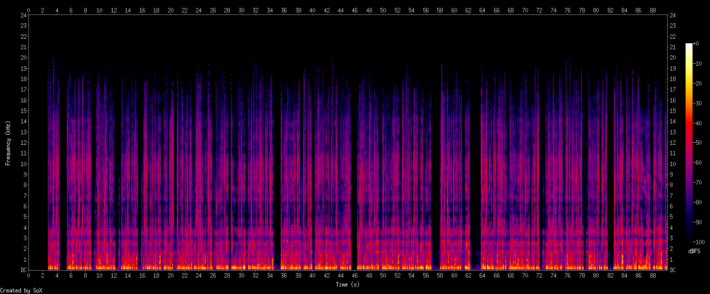
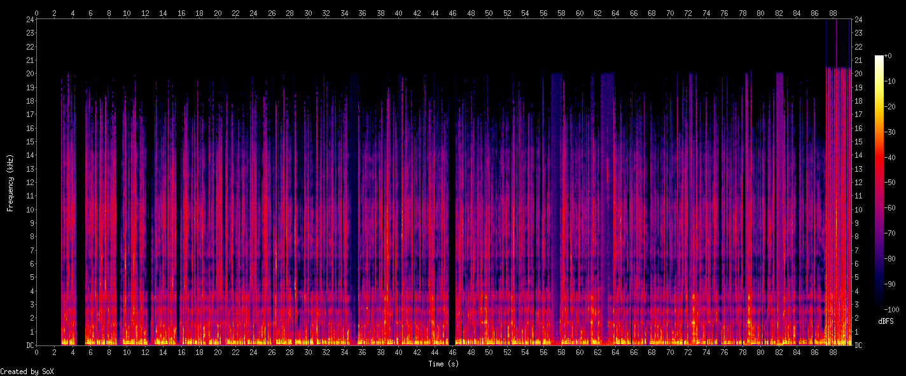
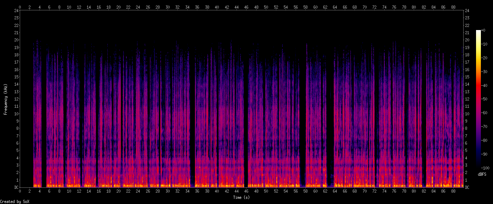

im having trouble with the ffmpeg loudnorm filter (audio volume normalization). usually my method works just fine (the last 100 times), but now i seem to have broken input files, which seem to cause a bug in loudnorm.

the audio sample is from an audiobook, so the volume often changes between silent and loud. the quiet parts are when the narrator inhales. problem is, after normalization the quiet parts are much too loud

these "volume glitches" are also visible in the spectrograms

note the differences before second 58 and 64

with audacity normalization this just works

